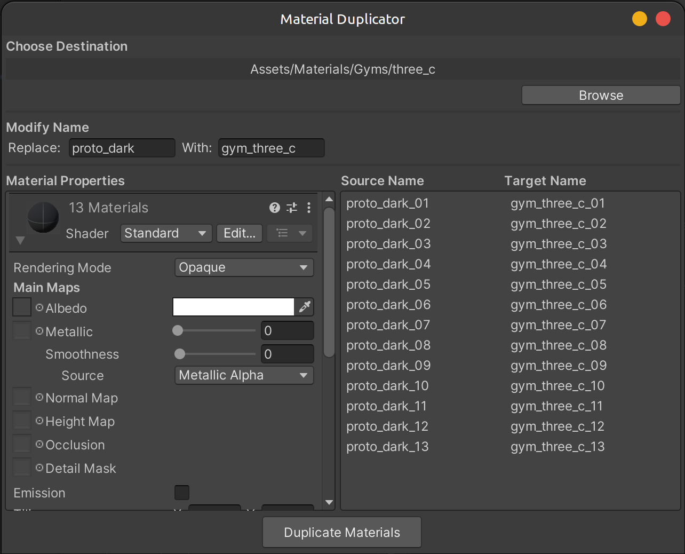

# MatGen
A simple editor tool to quickly generate a batch of materials for multiple textures.

## Generator
Generate a batch of materials from selected textures.

`Tools > MatGen > Generate Selected`

    

## Duplicator
Duplicate and modify a batch of materials.

`Tools > MatGen > Duplicate Selected`

    

